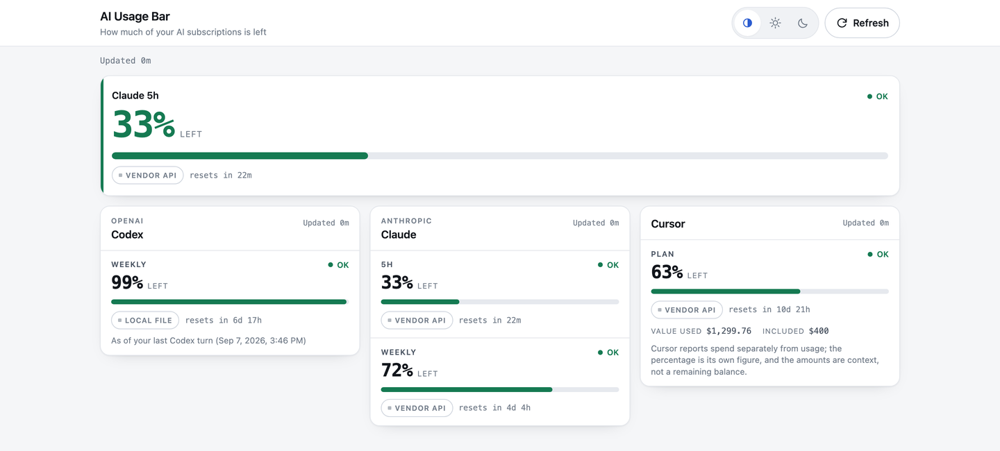
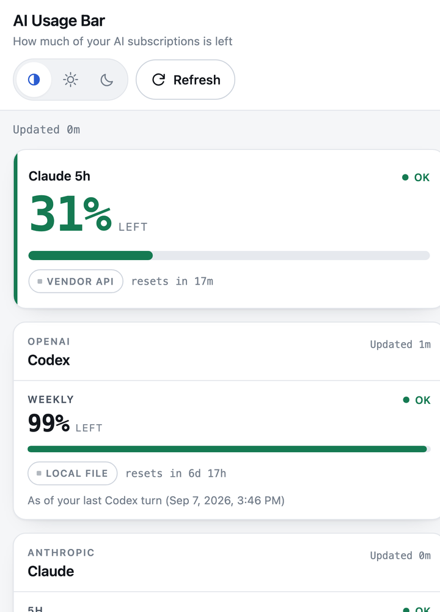

# AI Usage Bar

**A self-hosted web dashboard that shows how much of each AI subscription you have left, on any device.**
Not a menu bar app: it runs as a small server on one machine that stays on, and you open it from your phone.

[](https://github.com/duct-tape2/ai-usage-bar/actions/workflows/ci.yml)


<p>
  
</p>
<p>
  
</p>

```
Codex     weekly    99% left   resets in 6d 17h  [local file]
Claude    5h        33% left   resets in 22m     [vendor API]
Claude    weekly    72% left   resets in 4d 4h   [vendor API]
Cursor    plan      63% left   resets in 10d 21h [vendor API]
```

There are plenty of tools that tell you what you *spent*. This one answers the question
you actually ask before starting work: **can I keep going, or did I just burn the week's
quota, and on which plan?** It answers it from your phone, your tablet, or any other
machine, because it runs as a small server instead of an icon in your menu bar.

**What it reads and what it never sends.** Adapters read the numbers where the vendor's
own app already keeps them (a local file, or the vendor's API using the credential their
app stored on this machine). Nothing is proxied through anyone else's server, there is
no telemetry, and every meter shows which of those sources it came from. Details in
[SECURITY.md](SECURITY.md) and [RISKS.md](RISKS.md).

> **Status: early (0.1.0-dev).** Codex, Claude and Cursor are verified on a clean clone
> (CI runs a no-accounts boot test on Ubuntu and macOS). The ChatGPT Pro weekly counter is
> experimental and off by default; on 2026-09-07 the packaged adapter was run end to end
> against one real Pro account and counted 26 responses, the same figure as the
> maintainer's independent counter. Grok is not in the public version yet. Interfaces may
> still change.

## Why another one of these

The space is crowded, but almost entirely with macOS menu bar apps and CLI cost
trackers. They are good at what they do and this project does not compete with them.

What I could not find in any of them (checked 2026-09, corrections welcome):

| | menu bar apps | cost CLIs | AI Usage Bar |
|---|---|---|---|
| Remaining quota, not just spend | yes | no | yes |
| Reachable from your phone | no | no | **yes** |
| Runs headless on a NAS / server | no | partly | **yes** |
| Survives the laptop going to sleep | no | no | **yes** |
| Says where each number came from | no | no | **yes** |
| Consumer ChatGPT Pro weekly cap | no | no | **experimental** (I could not find another tool that counts it) |

If you want a menu bar app, use one — they are excellent. If you want the number on
your phone's home screen while the collector runs on a machine that never sleeps,
that is this.

## Quick start

Requires Node 20 or newer. No dependencies, no build step, no Docker required.

```bash
git clone https://github.com/duct-tape2/ai-usage-bar.git
cd ai-usage-bar
node bin/ai-usage-bar.mjs init      # write a starter config
node bin/ai-usage-bar.mjs doctor    # what this machine can read, and why not
node bin/ai-usage-bar.mjs serve     # http://127.0.0.1:8791
```

Once the npm package is published the same three commands work as
`npx ai-usage-bar init|doctor|serve` (not published yet).

`doctor` is the important one. It tells you, per provider, whether it is enabled,
what it would read, and what is missing — instead of leaving you with a blank page.

## Usage

### Commands

| Command | What it does |
|---|---|
| `init` | Writes `~/.config/ai-usage-bar/config.json` with every safe-tier provider enabled |
| `doctor` | Per provider: enabled or not, which tier, what it would read, what is missing |
| `serve [--port N]` | Runs the dashboard on `127.0.0.1:8791` (or `AI_USAGE_BAR_PORT`) |
| `serve --expose tailscale` | Binds your tailnet address. Refuses without a read token |
| `collect [--provider id]` | Runs the collectors once and prints the result, no server |
| `token read --new` | Creates a read token (stored 0600) for phones and other machines |

Provider ids: `codex`, `claude-code`, `cursor`, `chatgpt-pro`.

### Configuration

`init` writes the file; this is the whole shape of it:

```json
{
  "server": { "port": 8791, "host": "127.0.0.1" },
  "thresholds": { "warn": 0.75, "critical": 0.9 },
  "allowTiers": ["official-api", "local-file", "vendor-api"],
  "providers": {
    "codex": { "enabled": true },
    "claude-code": { "enabled": true },
    "cursor": { "enabled": true },
    "chatgpt-pro": { "enabled": false }
  }
}
```

A provider runs only when it is enabled **and** its tier is in `allowTiers`.
`doctor` tells you which half is missing. `thresholds` is where a card turns
amber and red.

### Turning on the ChatGPT Pro weekly counter

It is off by default because it reads your own account history through a borrowed
session (`session-scrape`). Read [RISKS.md](RISKS.md), then:

```json
{
  "allowTiers": ["official-api", "local-file", "vendor-api", "session-scrape"],
  "providers": {
    "chatgpt-pro": { "enabled": true, "proSlugs": ["gpt-6-pro"], "windowDays": 7 }
  }
}
```

`proSlugs` is the list of model slugs that count against the Pro cap; `windowDays`
is the rolling window. The first run prints exactly what it is about to do.

### Reading it from other tools

Everything the page shows is available as JSON, so a menu bar app, a tmux status
line or a home-screen widget can read the same numbers:

| Endpoint | Returns |
|---|---|
| `GET /api/usage` | Every meter, with provenance and reset times |
| `GET /api/summary` | The compact form a widget needs |
| `GET /api/summary.txt` | One line, short enough for a menubar |
| `GET /api/health` | Collector freshness; `ok: false` when something is stale |
| `POST /api/refresh` | Run the collectors now |

Remote reads send the token as `Authorization: Bearer <token>` (or `?token=` for
clients that cannot set headers; it is never logged).

### Keeping it running

The collector should live on the machine that never sleeps. Templates with the
two paths to edit are in [install/macos](install/macos) (launchd) and
[install/linux](install/linux) (systemd user unit). Updating is `git pull`; there
is no build step and nothing is written inside the checkout.

## Getting it on your phone

The dashboard binds `127.0.0.1` by default and **refuses to bind anything else
without a read token**. That is deliberate: the number of self-hosted dashboards
quietly serving personal data to a whole network is not a club worth joining.

```bash
node bin/ai-usage-bar.mjs token read --new          # prints a token, stores it 0600
node bin/ai-usage-bar.mjs serve --expose tailscale  # binds your tailnet address
```

Then, for a real HTTPS certificate and no self-signed-certificate pain on iOS
(needed if you want to install it to your home screen):

```bash
tailscale serve --bg --https=8443 http://127.0.0.1:8791
```

Use a port your dashboard is **not** already listening on.

**No Tailscale?** Bind your LAN address instead: `node bin/ai-usage-bar.mjs serve --host 192.168.1.20`
(still refuses without a read token). Open `http://192.168.1.20:8791/?token=<token>` once on
the phone; the token is then kept in a cookie for that browser. Put a reverse proxy with TLS in
front if the network is not yours. Pointing `tailscale serve`
at the same port the server binds makes the tailnet address stop answering plain
HTTP, which looks exactly like the server being down.

## Where the numbers come from

Every meter carries a provenance tier, shown on the card. This is the part other
dashboards leave out, and it is the difference between a number you can act on and
a number you have to trust blindly.

| Tier | Meaning | Default |
|---|---|---|
| `official-api` | A documented endpoint, with a key you supplied | **on** |
| `local-file` | Reads state the vendor's own app wrote on this machine. No network | **on** |
| `vendor-api` | The vendor's own API, for your account only, using the credential their app already stored here. Undocumented | **on** |
| `session-scrape` | A borrowed browser session, or scraped markup | off |
| `browser-automation` | Drives a browser you are already signed into | off |

The last two ship in the box but stay off until you turn them on in config, and the
first run prints what you are agreeing to. See [RISKS.md](RISKS.md) before enabling
them — **this matters, please read it.**

## Providers

The collector reads each provider on the machine where that provider's app is signed in.
Installing on an empty home server shows nothing until that machine has the files below.

| Provider | Needs on the collector machine | OS |
|---|---|---|
| Codex | The Codex CLI signed in (`~/.codex/sessions/` rollout files) | macOS, Linux |
| Claude Code | Claude Code signed in (its stored OAuth credential) | macOS (Keychain), Linux (credentials file) |
| Cursor | Cursor desktop signed in (its local state database) | macOS, Linux |
| ChatGPT Pro | A chatgpt.com session token, supplied once (see RISKS.md) | any |


| Provider | Tier | How | Status |
|---|---|---|---|
| Codex | `local-file` | The rate limits the Codex CLI already records in its own session files | working |
| Claude (Pro/Max) | `vendor-api` | The OAuth credential Claude Code stored here, against Anthropic's usage endpoint | working |
| Cursor | `vendor-api` | The token Cursor stored in its own local database | working |
| ChatGPT Pro weekly | `session-scrape` | Counts Pro responses in your own account history, so usage from your phone counts too | **experimental** |
| Grok | `vendor-api` | The credential the Grok CLI stored here | not in the public version yet |

**On ChatGPT Pro.** This is the number that made me build the project. It stays marked
experimental because it is a count of your own account history (session-scrape tier), not
a figure OpenAI publishes, and it has been verified against one account only: on
2026-09-07 the packaged adapter was run end to end with a real Pro session token and
counted 26 responses for the week, matching an independent counter on the same account.
The request has to look like the browser that owns the token; a generic client gets a
challenge page from OpenAI's edge, which the adapter reports as `rate_limited` and backs
off from rather than pretending. Long agentic conversations are attributed to the question
that asked, so a 500-node tool session counts as the handful of prompts it really was. It
is off by default; read [RISKS.md](RISKS.md) first.

Adding one is roughly thirty lines — see [docs/adapter-sdk.md](docs/adapter-sdk.md).
Provider breakage is the thing that kills projects like this, so the adapter surface
is deliberately small enough that you do not have to wait for a maintainer.

## Privacy

- Nothing is proxied through anyone else's server and there is no telemetry or hosted
  component. Adapters do talk to the vendors' own APIs (Anthropic, Cursor, and OpenAI if
  you enable the experimental counter), the same endpoints their apps already call.
- Credentials are never copied into this project's config; adapters read the ones
  the vendors' own apps already stored, and never hold a refresh token.
- What leaves the process is an allowlist, not a denylist: a meter may only carry
  the keys in the schema, so conversation ids, account identifiers and tokens cannot
  reach the wire even by accident. That guarantee is pinned by a test.
- The repository is read-only at runtime. Config lives in `~/.config/ai-usage-bar`,
  state in `~/.local/state/ai-usage-bar`, and a test fails the build if a run writes
  anything into the install directory.

## License

MIT. See [LICENSE](LICENSE).

Not affiliated with OpenAI, Anthropic, Cursor, xAI or any other provider. All
trademarks belong to their owners.
